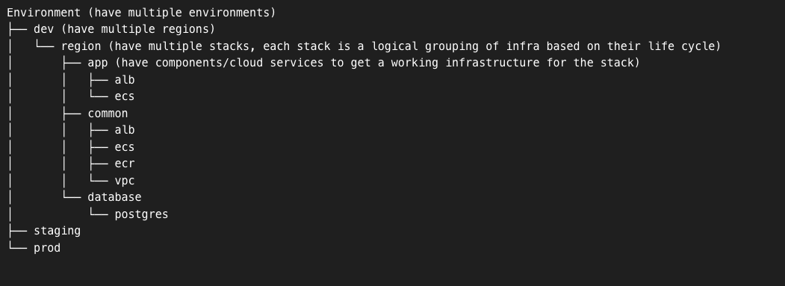
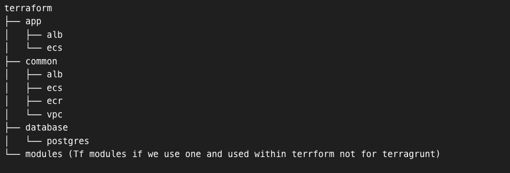

# Terragrunt

We assumed below folder structure for our terragrunt configuration which will guide the terrform config to be designed in a way we wanted.

[Tree Design](https://tree.nathanfriend.io/?s=(%27optKs!(%27fancy!true~fullPath3~trailFSlash3~rootDot3)~H(%27H%27E6-e6s%7D0dev-regKs%7DA*%20regK-7s%2C%20each%207JsGlogical%20groupF%20of9%20based%208Cheir%20lif2cycle%7D.Bpp5comp8ents%2Fcloud%20servicesCo%20getGworkF9structur2forCh27%7D***4%20comm84*ecrLvpc.%20databaseLpostgres0stagF0prod%27)~versK!%271%27)*I%20-5multipl2.A**0AI2e%203!false4LalbLecs.5%20%7Bhav26nvir8ment7stack8on9JnfraA%5CnGaC%20tFingGB%20Hsource!I%20%20J%20iKi8L.*%01LKJIHGFCBA987654320.-*)

Notes:
   - `terragrunt.hcl` file drive the execution of terraform source config files. 
   - The name of the `terragrunt.hcl` file should not be changed in the folder where the terraform source exist. The same file can have different name in the parent folders. 
   - We have `environment.hcl` file under `/dev` folder which should carry any environmen related variables and inputs.
   - We have a terragrunt config file at the root of project named `root.hcl` which need to be explicitly included in the child terragrunt config files. All globale variables and inputs will be manage here.
   - Run from terragrunt directory `terragrunt run-all plan ` to provision the infrastructure.
   - Before running terragrunt plan/apply set the aws profile. You can set the profile using the env variable AWS_PROFILE.

# Terraform

[Tree Design](https://tree.nathanfriend.io/?s=(%27options!(%27fancy!true~fullPath.~trailingSlash.~rootDot.)~6(%276%274aform*app2*common2-ecr-vpc*storage-postgres*0%7BTf%200if%20w3us3on3and%20used%20within5form%20not%20for5agrunt%7D7%27)~version!%271%27)*7%20%20-*%20.!false0modules%202-alb-ecs3e5terr5%2046source!7%5Cn%017654320.-*)

